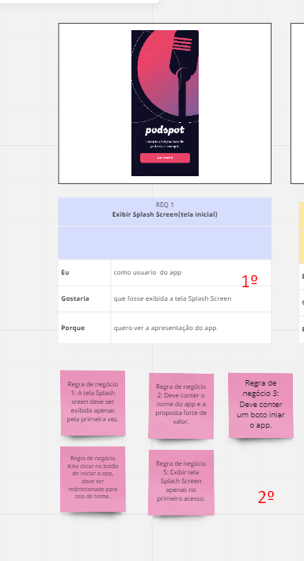
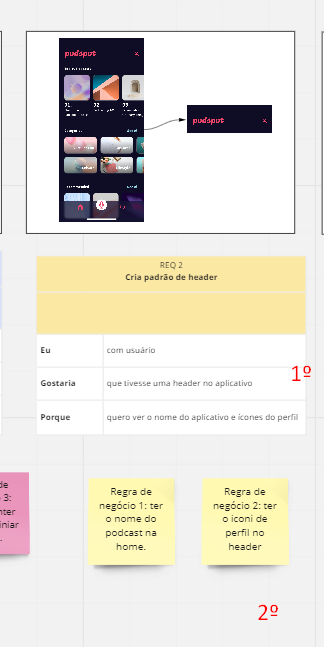

# Portifolio

- Prototipo no "miro"

Projeto para inico de teste do app de podcast
[figma](https://www.figma.com/file/QnIQrACqgG4ZN4qrpw8F04/PodcastAppChallenge-(1)?node-id=34%3A4500)

## RQ-1 imagen da tela inicial do app
## Primeiro Acesso
- Dado que acesse o podcast pela primeira vez
- Quando o app abre
- Então é exibido uma tela apresentação

## Acesar a Home
- Dado que estou na tela inicial do podcast
- Quando clico no botão start
- Então sou redirecionado para home do app

- 1ª Descrição da user story.

- 2º Regraas de negóico.

## RQ-2 Imagend a home do app

- 1º Descrição da user story

- 2º Regras de negócio